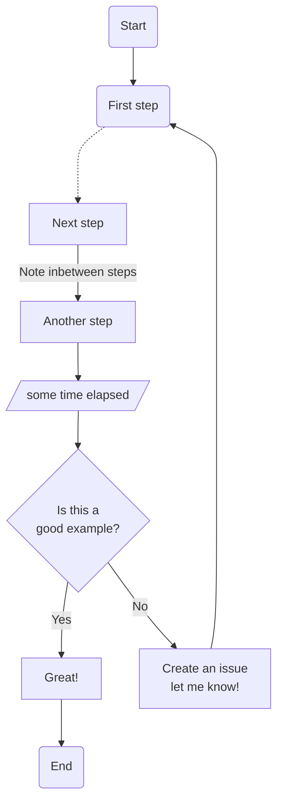

# Documentation

Here you will find flow diagrams documenting complex logic.

This is meant to be used as a source for communicating the logic flows in this application, and should written in a way for non-devs to understand.

## Contributing: Mermaid in markdown

> https://github.blog/2022-02-14-include-diagrams-markdown-files-mermaid/

Github has added support for generating diagrams written in mermaid inside markdown files.

Here are the mermaid docs: https://mermaid.js.org/syntax/flowchart.html

Heres an example:

