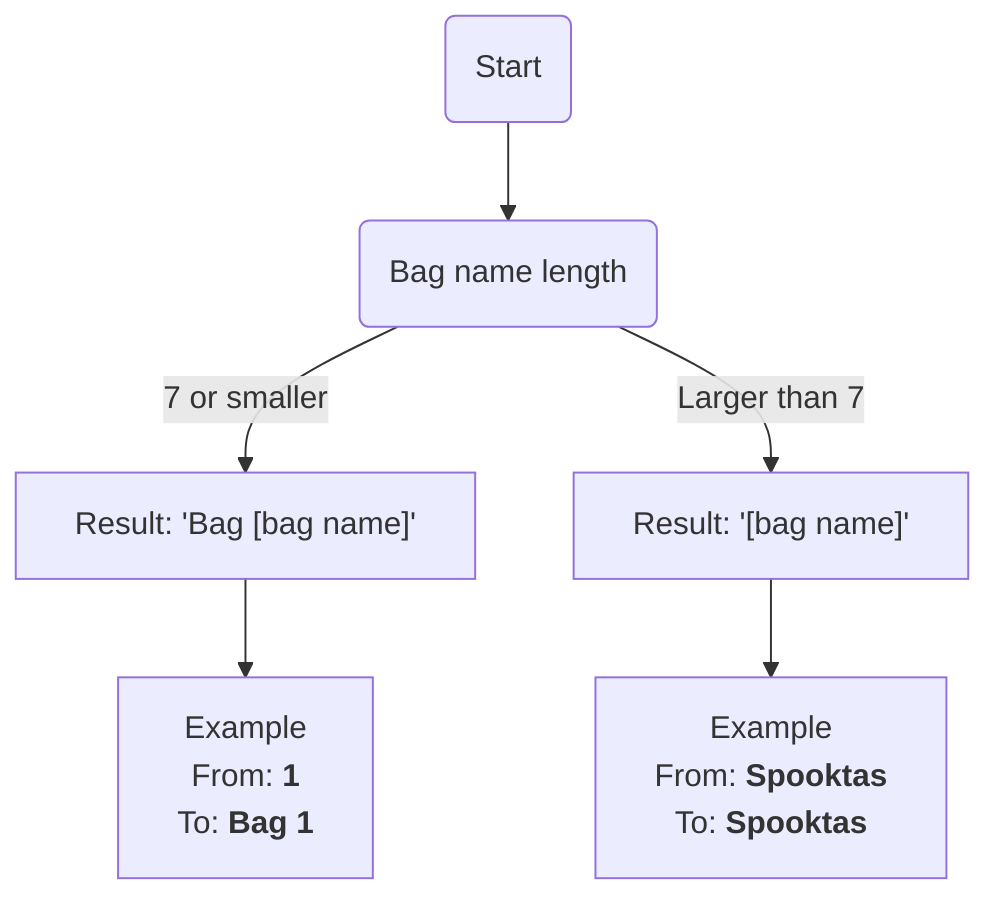

# Bag name

The bag name shown is prefixed with "Bag " to allow for translations to work separately from the bag's name.

```mermaid

flowchart TD
   ST(Start) --> A(Bag name length)
    A -->|7 or smaller| B1["Result: 'Bag [bag name]'"]
    A -->|Larger than 7| B2["Result: '[bag name]'"]
    B1 --> C1["`Example
    From:   **1**
    To:  **Bag 1**`"]
    B2 --> C2["`Example
    From: **Spooktas**
    To: **Spooktas**`"]
```
