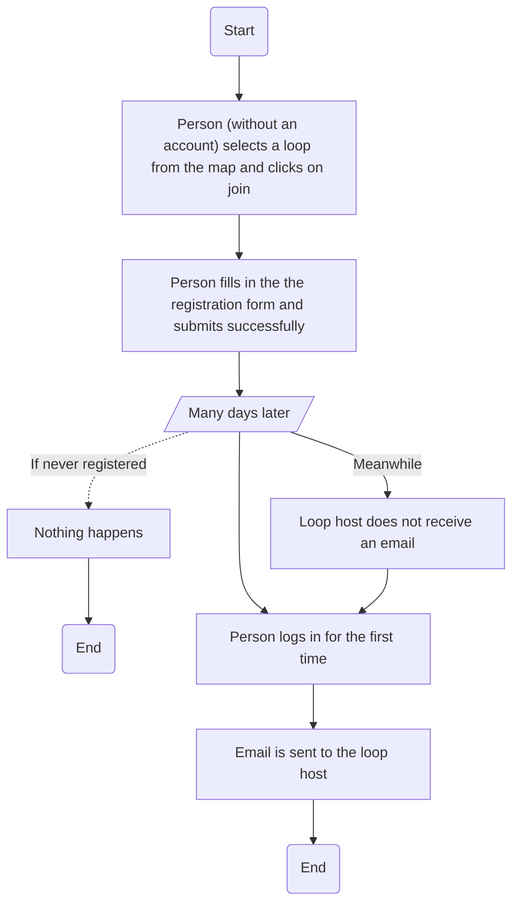
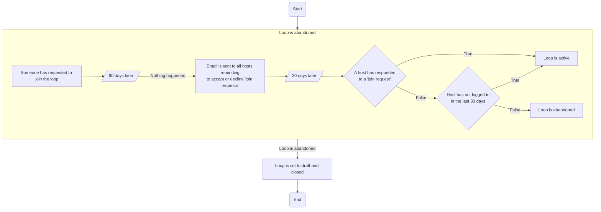
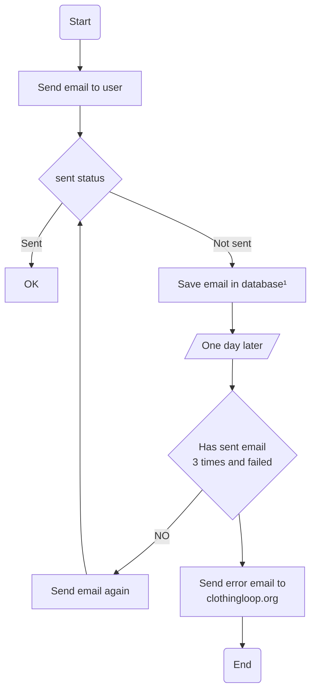
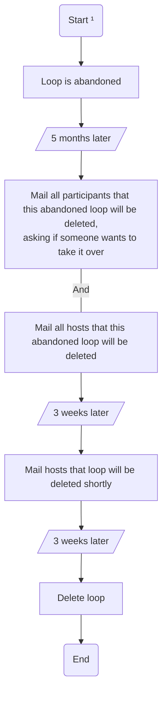

# Email flow diagrams

## Delayed unregistered loop approval

## Find abandoned loops

## Email resend #578

Email resends happen on these templates:

- an_admin_approved_your_join_request.gohtml
- an_admin_denied_your_join_request.gohtml
- approve_reminder.gohtml
- poke.gohtml
- register_verification.gohtml
- someone_is_interested_in_joining_your_loop.gohtml

¹ The emails can be found in the database following the first send failure in the database table `mail_retries`.

## Delete loops

¹ This begins at the end of [Find abandoned loops](https://github.com/the-clothing-loop/website/blob/main/server/docs/email_diagrams.md#find-abandoned-loops)
