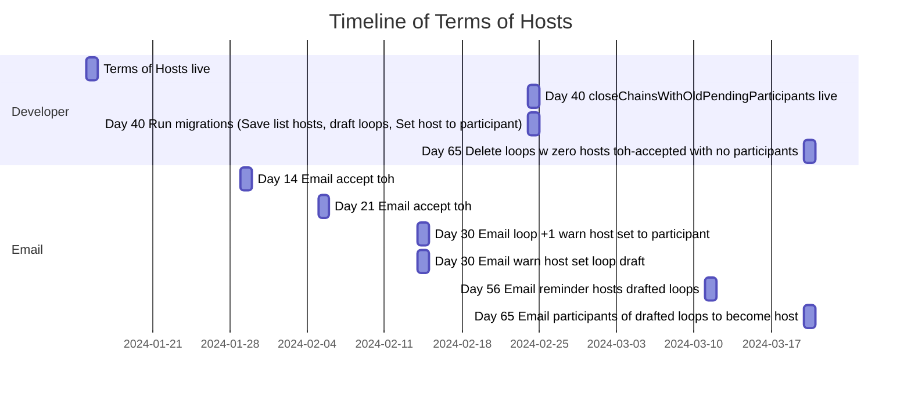
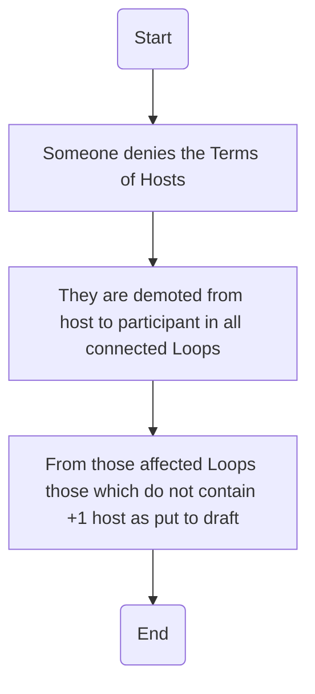

# Terms of Hosts

## General flow

**Migrations for Terms of Hosts (should be run 40 days after ToH start)**

After ToH start there will be steps to ease the migration:

- Day 14 & 21: Email all unaccepted hosts to accept the toh.
- Day 30:
  1.  Email unaccepted hosts that we will set them as participant, in Loops where +1 hosts have accepted toh.
  2.  Email all hosts in Loops, where all hosts have not accepted toh, that their Loop will be set to draft.
- Day 40: Run migration
  1.  "List hosts, in loops where none of the hosts have accepted the toh" save for day 56
  2.  "Draft all Loops where all the hosts have not accepted the toh"
  3.  "Set all the hosts who have not accepted the toh, in a Loop where +1 hosts have accepted toh, as participant."
  4.  Uncomment cron func "closeChainsWithOldPendingParticipants"
- Day 56: Send a reminder to hosts from loops, where all have not accepted toh
- Day 65: Send an email to all participants asking if they what to become host for this loop.

## Someone denies the Terms of Hosts

See code for more details [users.go:307 ~](/server/internal/controllers/users.go:307)
