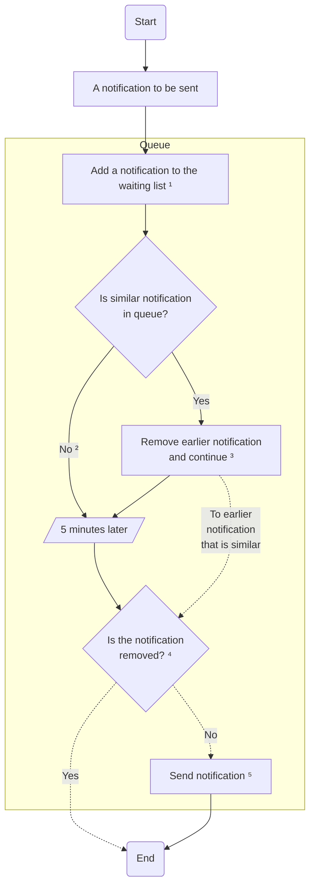
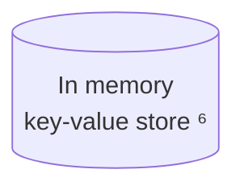

# In-App notification flows

## Block sending too many notifications

¹ Adds **NotifyID** to the KV store

² Adds **Tag** to the KV store

³ Removes the old **NotifyID** from the KV store and edits **Tag** to link to the new **NotifyID**

⁴ Checks if the **NotifyID** still exists

⁵ Removes both **Tag** & **NotifyID** from the KV store

⁶ This contains;

| Type     | Key                                                                                                          | Value                                |
| -------- | ------------------------------------------------------------------------------------------------------------ | ------------------------------------ |
| Tag      | searchable string that relates to the notification; `tag_routeorderchange_<chain_id>_<original_route_index>` | the key of the definition below      |
| NotifyID | id of the notification run (if not found the notification is deemed to be deleted); `notifyid_<uuid>`        | boolean (this should always be true) |
