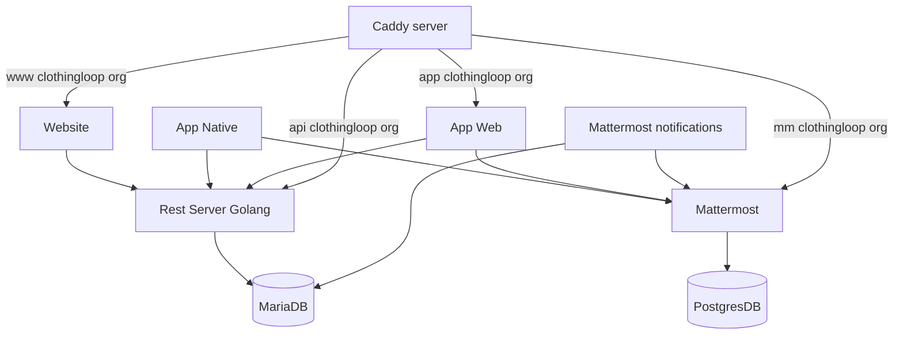

# Structure

```mermaid
flowchart TD

db1[(MariaDB)]
caddy["Caddy server"]
server["Rest Server Golang"]
app["App Native"]
appw["App Web"]
web["Website"]

db2[(PostgresDB)]
mm["Mattermost"]
mmmail["Mattermost notifications"]

server --> db1
web --> server
app -->server
appw -->server

app --> mm
appw --> mm
mm --> db2
mmmail --> mm
mmmail --> db1

caddy --> |app clothingloop org| appw
caddy --> |api clothingloop org| server
caddy --> |www clothingloop org| web
caddy --> |mm clothingloop org| mm
```
