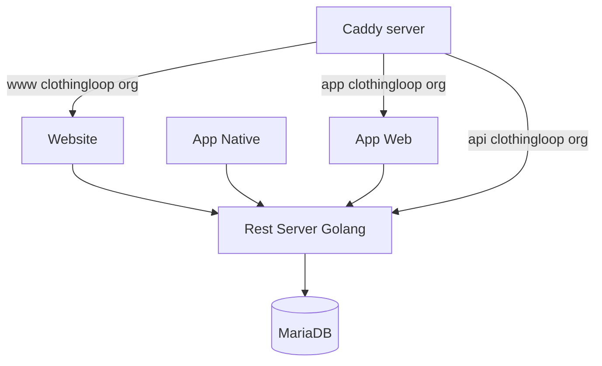

# Structure

```mermaid
flowchart TD

db1[(MariaDB)]
caddy["Caddy server"]
server["Rest Server Golang"]
app["App Native"]
appw["App Web"]
web["Website"]

server --> db1
web --> server
app -->server
appw -->server

caddy --> |app clothingloop org| appw
caddy --> |api clothingloop org| server
caddy --> |www clothingloop org| web
```
